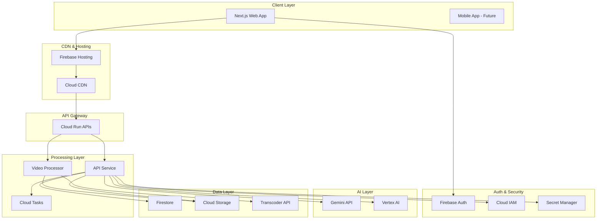

# AutoCut Architecture Documentation

## Table of Contents
- [Overview](#overview)
- [System Architecture](#system-architecture)
- [Component Details](#component-details)
- [Data Flow](#data-flow)
- [Security](#security)
- [Scalability](#scalability)
- [Technology Decisions](#technology-decisions)

## Overview

AutoCut is built on a modern, cloud-native architecture leveraging Google Cloud Platform (GCP) services. The system follows a microservices architecture pattern with clear separation of concerns between frontend, backend services, and data processing pipelines.

## System Architecture

### High-Level Architecture



### Component Architecture

```
┌─────────────────────────────────────────────────────────────────┐
│                         Frontend (Firebase)                      │
├─────────────────────────────────────────────────────────────────┤
│  • Next.js 14 App Router                                        │
│  • React Components with TypeScript                             │
│  • Firebase SDK (Auth, Firestore, Storage)                      │
│  • Tailwind CSS + Shadcn/ui                                     │
│  • Real-time Firestore listeners                                │
│  • Direct Cloud Storage uploads                                 │
└─────────────────────────────────────────────────────────────────┘
                                  │
                                  ▼
┌─────────────────────────────────────────────────────────────────┐
│                     API Service (Cloud Run)                      │
├─────────────────────────────────────────────────────────────────┤
│  • FastAPI Python application                                    │
│  • RESTful endpoints                                            │
│  • WebSocket support for real-time chat                         │
│  • Gemini API integration                                       │
│  • Cloud Tasks job scheduling                                   │
│  • Firestore database operations                                │
│  • Signed URL generation for uploads                            │
└─────────────────────────────────────────────────────────────────┘
                                  │
                                  ▼
┌─────────────────────────────────────────────────────────────────┐
│                  Video Processor (Cloud Run)                     │
├─────────────────────────────────────────────────────────────────┤
│  • Python-based video processing                                │
│  • FFmpeg integration                                           │
│  • Transcoder API for heavy processing                          │
│  • Custom effects and transitions                               │
│  • Audio mixing and synchronization                             │
│  • Output to Cloud Storage                                      │
└─────────────────────────────────────────────────────────────────┘
```

## Component Details

### 1. Frontend Application

**Technology**: Next.js 14 with TypeScript

**Responsibilities**:
- User interface and experience
- Authentication flow
- File upload management
- Real-time plan updates
- Video preview
- Chat interface

**Key Features**:
- Server-side rendering for SEO
- Progressive Web App capabilities
- Responsive design for all devices
- Real-time data synchronization

### 2. API Service

**Technology**: FastAPI (Python)

**Endpoints**:
```python
POST   /api/projects                 # Create new project
GET    /api/projects/{id}            # Get project details
PUT    /api/projects/{id}            # Update project
DELETE /api/projects/{id}            # Delete project

POST   /api/upload/initiate          # Get signed upload URL
POST   /api/upload/complete          # Mark upload complete

POST   /api/analyze                  # Trigger Gemini analysis
GET    /api/analysis/{id}            # Get analysis results

POST   /api/plan/generate            # Generate vlog plan
PUT    /api/plan/{id}               # Update plan
POST   /api/plan/{id}/chat          # Chat-based modification

POST   /api/render                   # Start video rendering
GET    /api/render/{id}/status      # Get render status
GET    /api/render/{id}/download    # Get download URL
```

**Key Integrations**:
- Gemini API for AI analysis
- Cloud Storage for media
- Firestore for metadata
- Cloud Tasks for async jobs

### 3. Video Processor Service

**Technology**: Python with FFmpeg

**Processing Pipeline**:
1. Receive job from Cloud Tasks
2. Download media from Cloud Storage
3. Apply editing operations:
   - Clip trimming and sequencing
   - Transition effects
   - Text overlays
   - Audio mixing
   - Color correction
4. Use Transcoder API for encoding
5. Upload final video to Cloud Storage
6. Update project status in Firestore

### 4. Database Schema (Firestore)

```javascript
// Users Collection
{
  userId: "string",
  email: "string",
  displayName: "string",
  photoURL: "string",
  subscription: {
    tier: "free|pro|business",
    validUntil: "timestamp",
    usage: {
      vlogsCreated: "number",
      storageUsed: "number"
    }
  },
  preferences: {
    defaultStyle: "string",
    emailNotifications: "boolean"
  },
  createdAt: "timestamp",
  lastLogin: "timestamp"
}

// Projects Collection
{
  projectId: "string",
  userId: "string",
  title: "string",
  description: "string",
  status: "uploading|analyzing|planning|editing|rendering|complete|failed",
  type: "travel|daily|event|custom",
  createdAt: "timestamp",
  updatedAt: "timestamp",

  media: [{
    fileId: "string",
    filename: "string",
    gcsUrl: "string",
    type: "photo|video",
    duration: "number", // for videos
    size: "number",
    metadata: {
      width: "number",
      height: "number",
      format: "string"
    }
  }],

  analysis: {
    geminiResponse: "object",
    scenes: [{
      id: "string",
      description: "string",
      mood: "string",
      objects: ["string"],
      location: "string",
      quality: "number"
    }],
    suggestedNarrative: "string",
    musicRecommendations: ["string"]
  },

  plan: {
    version: "number",
    timeline: [{
      id: "string",
      type: "clip|transition|text|music",
      startTime: "number",
      duration: "number",
      content: "object"
    }],
    settings: {
      totalDuration: "number",
      aspectRatio: "16:9|9:16|1:1",
      resolution: "720p|1080p|4k",
      style: "cinematic|casual|energetic"
    }
  },

  output: {
    url: "string",
    size: "number",
    duration: "number",
    format: "mp4|mov",
    renderedAt: "timestamp"
  }
}

// Chats Collection
{
  chatId: "string",
  projectId: "string",
  messages: [{
    id: "string",
    role: "user|assistant",
    content: "string",
    timestamp: "timestamp",
    planSnapshot: "object" // Plan state after this message
  }]
}
```

## Data Flow

### 1. Upload Flow
```
User selects files → Frontend requests signed URL → Direct upload to GCS
→ Frontend notifies backend → Backend creates project record → Returns project ID
```

### 2. Analysis Flow
```
Backend triggers analysis → Download media from GCS → Send to Gemini API
→ Parse response → Extract scenes/mood/objects → Store in Firestore
→ Notify frontend via Firestore listener
```

### 3. Plan Generation Flow
```
Retrieve analysis data → Apply vlog template rules → Generate timeline
→ Add transitions/music → Save plan to Firestore → Frontend updates UI
```

### 4. Chat Modification Flow
```
User sends message → WebSocket to backend → Parse intent with Gemini
→ Modify plan object → Validate changes → Update Firestore
→ Real-time update to frontend
```

### 5. Rendering Flow
```
User confirms plan → Create Cloud Task → Video Processor picks up task
→ Download media → Apply edits with FFmpeg → Use Transcoder API
→ Upload to GCS → Update project status → Notify user
```

## Security

### Authentication & Authorization
- **Firebase Authentication** for user management
- **Identity Platform** for enterprise SSO (future)
- **JWT tokens** for API authentication
- **Row-level security** in Firestore

### Data Security
- **Encryption at rest** for all storage
- **Encryption in transit** with TLS 1.3
- **Signed URLs** for secure uploads
- **VPC Service Controls** for API access
- **Secret Manager** for API keys

### Privacy
- **Data isolation** per user
- **GDPR compliance** with data deletion
- **Access logs** with Cloud Audit Logs
- **PII handling** following best practices

## Scalability

### Horizontal Scaling
- **Cloud Run** auto-scales from 0 to 1000 instances
- **Firestore** handles millions of concurrent connections
- **Cloud Storage** unlimited storage capacity
- **Cloud CDN** global edge locations

### Performance Optimization
- **Lazy loading** for media assets
- **Image optimization** with WebP format
- **Video streaming** with adaptive bitrate
- **Caching strategy**:
  - CDN for static assets
  - Firestore offline persistence
  - Redis for session data (future)

### Cost Optimization
- **Scale to zero** when not in use
- **Committed use discounts** for predictable workloads
- **Lifecycle policies** for old media
- **Regional resources** where appropriate

## Technology Decisions

### Why Google Cloud Platform?

1. **Gemini Integration**: Native integration with Gemini API
2. **Unified Billing**: Single invoice for all services
3. **IAM Integration**: Seamless service-to-service auth
4. **Managed Services**: Reduced operational overhead
5. **Global Scale**: Presence in 35+ regions

### Why Next.js + FastAPI?

1. **Next.js**:
   - React ecosystem maturity
   - Built-in optimization
   - Excellent DX with hot reload
   - TypeScript support
   - SEO capabilities

2. **FastAPI**:
   - Async Python for performance
   - Automatic API documentation
   - Type hints and validation
   - WebSocket support
   - Easy Gemini SDK integration

### Why Firestore over Cloud SQL?

1. **Real-time updates** out of the box
2. **NoSQL flexibility** for varied media metadata
3. **Offline support** for frontend
4. **Automatic scaling** without management
5. **Cost-effective** for document-based data

### Why Cloud Run over GKE?

1. **Simplicity**: No cluster management
2. **Cost**: Pay only for actual usage
3. **Scale to zero**: Perfect for MVPs
4. **Quick deployment**: Single command deploy
5. **Automatic SSL**: Built-in HTTPS

## Monitoring & Observability

### Metrics
- **Cloud Monitoring** for system metrics
- **Custom metrics** for business KPIs
- **Real User Monitoring** with Firebase Performance
- **Synthetic monitoring** for API endpoints

### Logging
- **Structured logging** with Cloud Logging
- **Distributed tracing** with Cloud Trace
- **Error tracking** with Error Reporting
- **Log aggregation** and analysis

### Alerts
- **Uptime checks** for critical endpoints
- **Budget alerts** for cost management
- **Performance degradation** alerts
- **Security anomaly** detection

## Disaster Recovery

### Backup Strategy
- **Firestore backups** daily to Cloud Storage
- **Media files** replicated across regions
- **Configuration** in version control
- **Secrets** backed up in Secret Manager

### Recovery Procedures
- **RTO**: 1 hour for critical services
- **RPO**: 24 hours for data recovery
- **Failover**: Multi-region deployment ready
- **Rollback**: Blue-green deployment support

## Future Enhancements

### Phase 2 Features
- WebRTC for real-time collaboration
- GraphQL API for flexible queries
- Redis for caching and sessions
- Kubernetes for complex workloads

### Phase 3 Features
- Multi-region active-active setup
- Edge computing with Cloudflare Workers
- Machine learning pipeline with Vertex AI
- Event sourcing for audit trail

## Conclusion

The AutoCut architecture is designed to be:
- **Scalable**: Handle growth from 10 to 10M users
- **Maintainable**: Clear separation of concerns
- **Cost-effective**: Optimize for actual usage
- **Secure**: Defense in depth approach
- **Performant**: Fast response times globally

This architecture provides a solid foundation for building a production-ready vlog generation platform while maintaining flexibility for future enhancements.